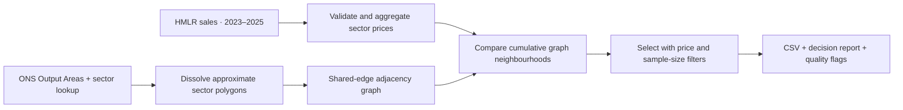

# Postcode Signals

**Find housing markets that stand out from their surroundings — and see how reliable the comparison is.**

Postcode Signals turns public house-sale records and geographic boundaries into an explainable area-level dataset for England and Wales. It asks: **which postcode sectors have a median sold-home price more than 20% above nearby sectors?**

The result can support geographic campaign experiments, market prioritisation and data analysis. It is a housing-price signal, not a measure of residents' income, net worth or purchasing intent.

**[Explore the example report](docs/examples/area-shortlist.md)** · **[Download selected sectors](output/selected.csv)** · **[Product and architecture decisions](docs/product-decisions.md)** · **[How it was built with agents](docs/agentic-development.md)**

## The delivered result

| September 2026 reference run | Result |
| --- | ---: |
| Qualifying residential sales, 2023–2025 | 2,265,966 |
| Distinct sectors represented | 8,241 |
| Sectors with a usable two-step comparison | 8,064 (97.9%) |
| Sectors above the strict 20% local-premium threshold | 1,607 |
| Candidates remaining with at least 20 sales | 1,552 |

The original delivery retains 55 low-sale candidates with flags. The [decision example](docs/examples/area-shortlist.md) uses a 20-sale floor and exposes sparse neighbours too. These are screening rules, not statistical confidence guarantees. [Coverage and source evidence →](output/run_manifest.json)

## What the maps mean


The maps distinguish **locally higher prices**, **nationally expensive housing** and **insufficient sales evidence**. The 20-sale floor belongs to the more conservative example shortlist; the original delivery retains sparse observations with flags. [Figure notes and reproduction →](docs/figures/README.md)

## Where it could be useful

| Decision | How to use the output | Evidence still needed |
| --- | --- | --- |
| Where to test advertising | Build candidate geographic test and control groups | Permitted targeting geography, data rights and measured incremental response |
| Which markets to investigate | Compare local premium, national percentile and sales counts | Serviceability, competition, demand and unit economics |
| What explains local variation | Join sector-level indicators and examine the graph | Property-mix controls, sensitivity checks and current geography |

Commercial activation requires checking upstream data rights and current platform rules. Aggregation alone does not establish permission for every use. See [data terms](DATA_LICENSE.md) and the [experiment design](docs/product-decisions.md).

## Try it without downloading data

Clone the repository and run from its root with Python 3.12:

```console
python examples/area_shortlist.py --output reports/area-shortlist.md
python scripts/verify_snapshot.py
```

Both commands use only the standard library and committed aggregate files. The first writes a readable shortlist report; the second checks the six published data files against their recorded sizes and SHA-256 hashes.

For the full CLI and tests, create a virtual environment and install the recorded dependencies:

```console
python -m venv .venv
# Windows PowerShell: .\.venv\Scripts\Activate.ps1
# macOS/Linux: source .venv/bin/activate
python -m pip install -r requirements.lock.txt
python -m pytest -q
```

Tests exercise ingestion, geometry, graph traversal, exact selection boundaries and independent verification of the complete national output. [CI runs on Linux and Windows](https://github.com/pranman/postcode-signals/actions/workflows/tests.yml); tests do not download national data.

## How the system works



A small Python CLI keeps the decision inspectable: pandas for statistics, GeoPandas/Shapely for geometry and NetworkX for shortest-path neighbourhoods. There is no hosted service or database to operate. Source downloads are cached locally; compact derived outputs are versioned.


`local premium = subject median / median(neighbouring sector medians) - 1`

The neighbourhood includes distinct sectors one or two graph edges away and excludes the subject. Available sector medians receive equal weight; unpriced sectors remain in the graph for traversal.

## Rebuild or experiment

Use a separate output directory to preserve the reference delivery:

```console
python wealth.py prices --years 2023 2024 2025 --min-sales 20 --output-dir reports/run
python wealth.py geography --output-dir reports/run
python wealth.py analyse --layers 1 2 3 --output-dir reports/run
python wealth.py select --layer 2 --above 0.20 --min-sales 20 --output-dir reports/run
```

Use `--min-sales 1` on the last command to reproduce the original selection policy. The geography stage needs national downloads and local processing; it is not needed to read the CSVs. Publisher revisions can change a fresh rebuild. The original `run_manifest.json` is a fixed delivery record and is **not regenerated by these commands**. See [methodology, exact sources and reproduction limits](docs/methodology.md).

## Built through an evidence-led agent workflow

The initial delivery used seven behaviour-sized issues, separate implementation and validation commits, local tests and a national run. The build recorded **GPT-6 Astra with `xhigh` reasoning**, **14 commits** and **34 passing tests at delivery**. The current repository adds parallel review, regression fixes, CI and a reproducible decision example.

[The development case study](docs/agentic-development.md) connects requirements to design tradeoffs, verification and the issue/commit trail. [Exported usage counters](docs/development-metrics.json) record **1,833,042 tokens** for the original implementation turn, including **1,722,880 cached input tokens**. These counters are not unique text volume, cost or a productivity benchmark.

## Scope and reuse

Prices describe sold housing, with no inflation, property-mix, floor-area or tenure adjustment. Approximate 2021 polygons do not cover every later postcode sector. Missing comparisons remain visible and cannot enter the shortlist. Commercial impact and individual wealth are unmeasured.

Original software and documentation: [MIT](LICENSE). Data and derived figures: [upstream attribution and terms](DATA_LICENSE.md). [Contributing](CONTRIBUTING.md) · [Security reporting](SECURITY.md) · [Engineering backlog](https://github.com/pranman/postcode-signals/issues)
