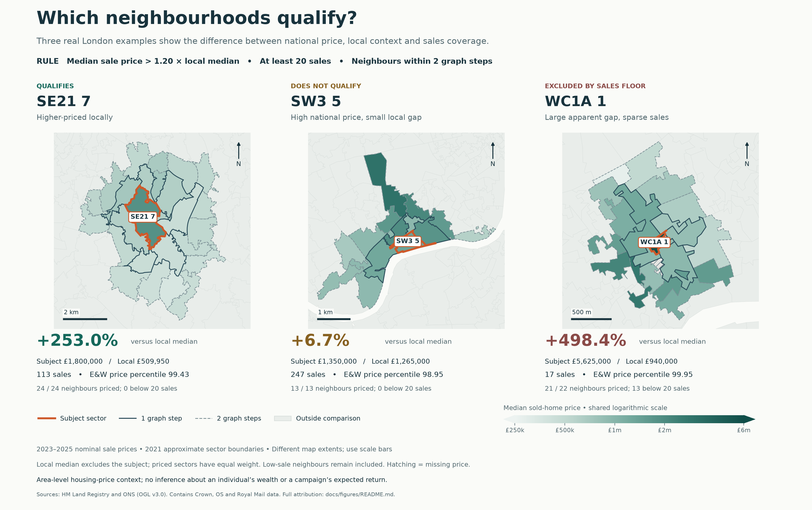
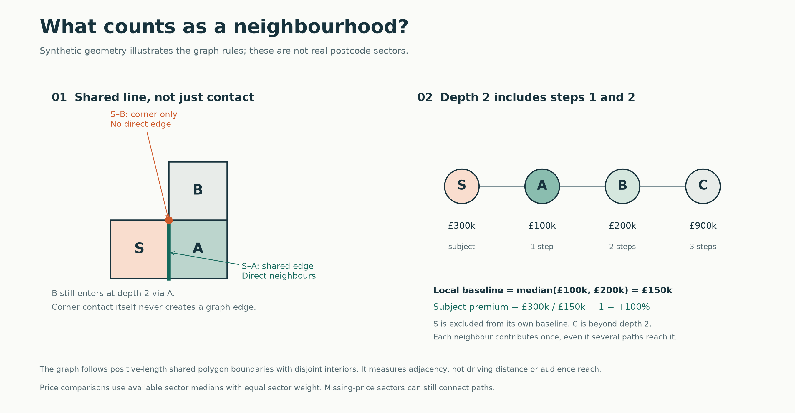

# Reading the neighbourhood figures

The maps illustrate the more conservative example shortlist using actual delivered results: a sector qualifies when its recorded median sale price is **strictly more than 20% above** the local baseline and it has **at least 20 qualifying sales**. The baseline is the unweighted median of available sector medians within two cumulative graph steps, excluding the subject. This is area-level housing-price context, not a measure of any resident's income or net worth.



| Example | Subject median | Local baseline | Local premium | Sales | E&W price percentile | Outcome |
| --- | ---: | ---: | ---: | ---: | ---: | --- |
| SE21 7 | £1,800,000 | £509,950 | +253.0% | 113 | 99.43 | Qualifies |
| SW3 5 | £1,350,000 | £1,265,000 | +6.7% | 247 | 98.95 | High nationally, but below the local-premium threshold |
| WC1A 1 | £5,625,000 | £940,000 | +498.4% | 17 | 99.95 | Excluded by the 20-sale floor |

The sparse example is included to explain an exclusion; it is not a shortlisted recommendation. These deliberately contrasting cases explain the rule and are not a representative sample of the full dataset. The original delivered selection allowed one sale; the maps illustrate the stricter 20-sale shortlist used in the [offline example report](../examples/area-shortlist.md).

The orange border marks the subject. Solid dark borders indicate one graph step; dashed borders indicate two. Background polygons sit outside that subject's comparison. Hatching indicates missing price data. Fill colour shows median sale price on a shared logarithmic scale; values beyond the endpoints are clipped. Each map has its own extent and scale bar. North points up. Geometry is plotted in British National Grid (EPSG:27700), without a street basemap or online tile service.

Low-sale neighbouring medians remain in the baseline even when the subject must have 20 sales. The map lists low-sale and missing-price neighbour counts so this limitation stays visible. No inflation, property-mix, floor-area or tenure adjustment has been made. Boundaries are approximations constructed from 2021 Output Areas and a best-fit postcode-sector lookup; they are not authoritative Royal Mail postcode boundaries.

## Why a corner does not count



This second figure is explicitly synthetic. A shared boundary line creates an edge; a point contact does not. A corner-touching sector can still be reached indirectly through another sector. At depth two, both first- and second-step neighbours enter once, while the subject is excluded from its own baseline. Graph distance is not travel distance or advertising-platform reach.

## Reproduce the figures

From the repository root, with the Python environment used for the pipeline:

```console
python -m pip install -r requirements.txt -r requirements-figures.txt
python examples/make_figures.py
```

The script reads `output/neighbour_analysis.csv`, `output/adjacency.csv` and the locally generated `output/sectors.geojson`. The first two are committed. The approximately 53 MB geometry is deliberately ignored by Git. To create it if absent:

```console
python wealth.py geography
python examples/make_figures.py
```

The geography command may download its public source files if they are not cached. Figure generation itself never downloads data. Fresh sources can change results; use the source hashes in `output/run_manifest.json` and the [figure data manifest](figure-data.json) when reproducing the delivered snapshot. If geography or prices change, rerun analysis and review the chosen examples before regenerating the figures. The script checks the example decision rules and neighbour counts rather than silently retaining stale outcome captions.

Optional paths:

```console
python examples/make_figures.py --data-dir output --output-dir docs/figures
```

Outputs are `local-price-comparison.png`, `neighbourhood-rule.png` and `figure-data.json`. The manifest records the exact plotted scores, input SHA-256 hashes and Matplotlib version. There is no generation timestamp. Pixel output can vary with plotting-library versions; quantitative inputs remain inspectable in the manifest.

## Sources and attribution

The real maps use the delivered 2023–2025 HM Land Registry sales aggregates and 2021 ONS geography. The synthetic schematic uses invented shapes and prices.

Contains HM Land Registry data © Crown copyright and database right 2021. This data is licensed under the Open Government Licence v3.0.

Source: Office for National Statistics licensed under the Open Government Licence v.3.0.

Contains OS data © Crown copyright and database right 2026.

Contains Royal Mail data © Royal Mail copyright and database right 2026.

See the [methodology and source links](../methodology.md) for full source definitions, limitations and reuse conditions. Retain attribution when reusing the figures.
